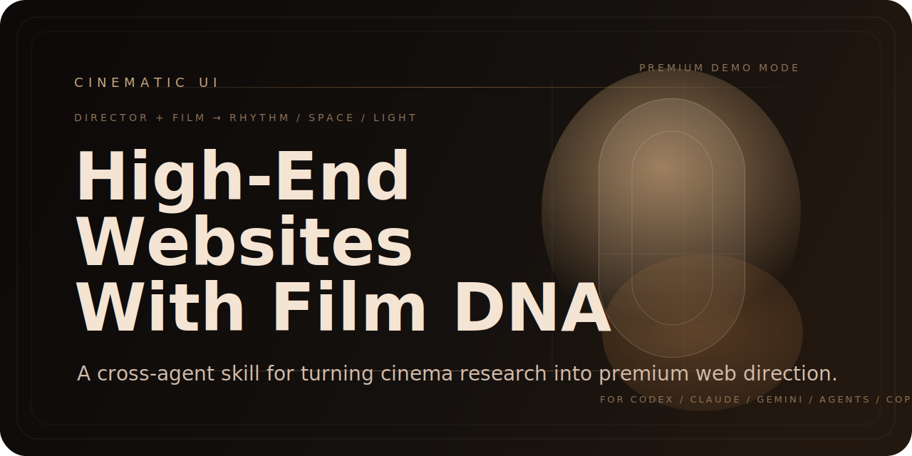

# Cinematic Layout

<p align="center">
  
</p>

<p align="center">
  <strong>把导演与电影研究，转成高端网站的节奏、空间、灯光与主构图。</strong>
</p>

<p align="center">
  <a href="./README.md">English</a> ·
  <a href="./README.zh-TW.md">繁體中文</a> ·
  <a href="./README.ja.md">日本語</a> ·
  <a href="./README.es.md">Español</a> ·
  <a href="./README.fr.md">Français</a> ·
  <a href="./README.de.md">Deutsch</a> ·
  <a href="./README.ko.md">한국어</a> ·
  <a href="./README.pt.md">Português</a> ·
  <a href="./README.vi.md">Tiếng Việt</a>
</p>

<p align="center">
  <a href="https://opensource.org/licenses/MIT"></a>
  <a href="./AGENTS.md"></a>
  <a href="./CLAUDE.md"></a>
  <a href="./CODEX.md"></a>
  <a href="./GEMINI.md"></a>
  <a href="./.github/copilot-instructions.md"></a>
  <a href="./.cursor/rules/cinematic-ui.mdc"></a>
  <a href="./.windsurf/rules/cinematic-ui.md"></a>
</p>

<p align="center">
  <a href="https://www.threads.com/@darkseoking"></a>
  <a href="https://xhslink.com/m/3fZJnT4jDHe"></a>
</p>

---

## 为什么不一样

大多数 AI 设计 skill，本质上是**查找表**。

它们给 AI 一个数据库——67 种风格、161 种配色方案、50 种组件模式——然后让 AI 从菜单上挑选。结果技术上干净，偶尔精致，但可靠地令人遗忘。AI 不是在思考，它是在购物。

**Cinematic UI 是思考框架，不是素材库。**

这个 skill 不是递给 AI 一份菜单，而是强迫它用真实电影导演的方式工作：

1. 研究特定导演与特定电影——灯光逻辑、构图纪律、场景节奏、材质感
2. 提取那部电影的视觉语言在结构层面上为何有效
3. 为网站发展一个原创视觉主题：这个页面是什么类型的场景？哪个构图在这里是不可替代的？
4. 用电影语言来为每一个版型决策做出论证
5. 最后才进入 CSS、动态效果与实作的规格化

输出的差异，不是程度上的差别，而是类别上的不同。

查找表产出的是「看起来像网站」的网站。导演工作流产出的是「感觉像某个有观点的人做的」网站。

> AI 不是从货架上挑商品的店员。
> AI 是导演。电影是创作简报。网站是这部作品的制作。

---

## 这是什么

`cinematic-layout` 不是单纯的「高级网站 prompt」，也不是只给某个工具用的 skill。

它是一套**跨工具可用的电影语言网站工作流**，核心逻辑：

1. 先选定 **导演 + 具体电影**
2. 若环境可上网，先研究导演与电影，补足镜头、灯光、节奏、材质与场景控制
3. 把电影语言转译成**网站可执行的叙事与版型系统**
4. 为每个主要页面角色定义独立场景与不可替代的主构图
5. 最后才进入 HTML / CSS / JS 的规格化与实作

> 电影不是规格书；电影是研究输入。
> 真正被电脑化的是后面的网站转译流程——也就是把研究整理成 `decisions.md`、`storyboard.md`、`compiled-spec.md` 与前端实作。

---

## 主要解决的痛点

这个 skill 不是在解决「AI 不会写 HTML」，而是在解决 AI 很常做不好的**高阶设计问题**：

| 痛点 | 具体表现 | Skill 的解法 |
|------|---------|-------------|
| **节奏** | 区块顺序合理，但看起来像简报，不像被导演过的网站 | 用导演叙事模板取代预设的 Hero → Features → Stats → CTA |
| **空间** | 元件都在，但视线、距离、层级、压力感不足 | 强制定义每页的 Signature Composition，不允许退化为预设 grid |
| **灯光** | 只有表面 glow，没有真正的光感、遮光、材质与空间照度 | 从具体电影场景取色，搭配 background-techniques 资料库 |
| **高端感** | 页面干净，但不够贵、不够准、不够克制 | Premium Calibration 自问清单，强制做「刻意不做什么」的决策 |
| **独特性** | 做多个网站后，hero 姿态、section 节奏越来越像 | Demo Uniqueness Protocol：做历史比对、列出 Shell-ban list |

---

## 核心特色

| 特色 | 说明 |
|------|------|
| **推理优先** | AI 必须发展原创视觉主题——不从预设库中挑选 |
| **Director-first** | 感觉来源先来自导演与电影，不是 generic premium branding |
| **Research-first** | 若工具支援网络，先研究导演与电影，再锁定 decisions phase |
| **Start questionnaire gate** | 每次 invocation 都要先完成起手问卷，再进 Phase 1 |
| **Storyboard-first** | 先写 `decisions.md`、`storyboard.md`、`compiled-spec.md`，再写前端 |
| **Demo Uniqueness Protocol** | 同一位使用者多次做不同网站时，先做历史比对、列出 Shell-ban list，避免每个 demo 越来越像 |
| **Anti-grid fallback** | Grid 只能当对齐基础，不能直接退化成可见的预设主构图 |
| **Sub-agent friendly** | 环境支援时，可把电影 research、niche research、页面场景、分页规格拆给 sub-agents，但仍由主代理统一总导演与最终审美 |

---

## 工作流程

| Phase | 主要工作 | 输出 Artifact |
|-------|---------|--------------|
| **Phase 1 — Decisions** | 完成起手问卷、选导演 + 电影、做 uniqueness audit、若可上网先研究电影 | `decisions.md` |
| **Phase 2 — Storyboard** | 先定全站电影语法、替每个页面角色定义 scene thesis、锁定每页 signature composition | `storyboard.md` |
| **Phase 3 — Compiled Spec** | 按 storyboard 抽取 camera / interaction / composition / texture / typography，共享系统最后才推导 | `compiled-spec.md` |
| **Phase 4 — Build & Verify** | 依 spec 实作，补上 reduced-motion / responsive，用 anti-garbage rules 回头检查 | HTML / CSS / JS |

> **Phase 2 内部顺序（不可跳过）：**
> 全站电影语法 → 各页 scene thesis → 各页 signature composition → 共用系统

---

## 支援哪些 AI / Agent 工具

这个 repo 的定位是「跨 agent skill package」。**Claude Code 与 OpenAI Codex 是两个主要平台。**

| 工具 | 入口文件 | 安装 / 配置 |
|------|---------|-----------|
| **Claude Code**（主要） | [`CLAUDE.md`](./CLAUDE.md) | `~/.claude/skills/cinematic-ui` |
| **Codex / ChatGPT**（主要） | [`CODEX.md`](./CODEX.md) | `$CODEX_HOME/skills/cinematic-ui` |
| **Cursor** | [`.cursor/rules/cinematic-ui.mdc`](./.cursor/rules/cinematic-ui.mdc) | 已在 `.cursor/rules/` 内——clone 即可使用 |
| **Windsurf** | [`.windsurf/rules/cinematic-ui.md`](./.windsurf/rules/cinematic-ui.md) | 已在 `.windsurf/rules/` 内——clone 即可使用 |
| **GitHub Copilot** | [`.github/copilot-instructions.md`](./.github/copilot-instructions.md) | 已在 `.github/` 内——clone 即可使用 |
| **Gemini / Antigravity** | [`GEMINI.md`](./GEMINI.md) | 于项目启动时读取 |
| **跨工具共用** | [`AGENTS.md`](./AGENTS.md) | 任何 agent 的通用参考基准 |

---

## References 资料库索引

所有参考资料放在 `references/` 目录下，按 phase 分工：

### 核心规则文件

| 文件 | 用途 |
|------|------|
| [`references/premium-calibration.md`](./references/premium-calibration.md) | Director brief 完成后，用来自问「这个设计够不够贵、够不够克制」 |
| [`references/anti-garbage.md`](./references/anti-garbage.md) | 列出 AI 常见的设计劣化模式，Phase 3 + Phase 4 都要过一遍 |
| [`references/anti-convergence.md`](./references/anti-convergence.md) | Hash-based 选取系统，防止多个 demo 或多个页面版型越做越像 |
| [`references/implementation-guardrails.md`](./references/implementation-guardrails.md) | Phase 3–4 的具体防偷懒规则：JS 效果清单、Entrance Map 规范、Phase 3 checklist |
| [`references/reference-protocol.md`](./references/reference-protocol.md) | 使用者提供参考网站时，如何分解借鉴而不抄袭 |
| [`references/output-templates.md`](./references/output-templates.md) | 每个 phase artifact 的标准格式模板 |
| [`references/library-index.md`](./references/library-index.md) | 告诉 AI 每个 phase 该读哪些文件、不该读哪些 |

### Phase 1

| 文件 | 内容 |
|------|------|
| `references/data/directors-200.md` | 200+ 位导演，依类型分类，含代表作与视觉风格描述 |

### Phase 2

| 文件 | 内容 |
|------|------|
| `references/data/hero-archetypes.md` | 30 种 hero 骨架选项 |
| `references/data/narrative-beats.md` | 25 个叙事节拍 + 18 位导演的叙事弧线模板 |
| `references/data/section-functions.md` | 50 种功能性 section 类型 |
| `references/data/section-archetypes.md` | 91+ 种 section 骨架选项 |
| `references/data/dna-index.tsv` | 1486 个网站的 Design DNA 索引，可按 mood / 字型 / 动态风格搜索 |
| `references/data/design-dna-db.txt` | DNA 索引命中后的深度站点资料 |

### Phase 3

| 文件 | 内容 |
|------|------|
| `references/data/camera-shots-50.md` | 55 种入场 / reveal 行为的 CSS |
| `references/data/interaction-effects-50.md` | 55+ 种 hover / click / scroll 互动效果（含需要 JS 的版本） |
| `references/data/compositions.md` | 80 种版型构图与 grid 逻辑 |
| `references/data/visual-elements.md` | 40 种视觉装饰元素（frame、badge、glow、halo、separator…） |
| `references/data/background-techniques.md` | 50+ 种 hero 背景与氛围层技法 |
| `references/data/typography-cinema.md` | 40+ 种文字表演与层级处理 |
| `references/data/color-grades.md` | 40+ 种电影调色板转 UI token |
| `references/data/font-moods.md` | 30+ 种字型配对，依气质分类 |
| `references/data/textures.md` | 30+ 种 grain / grid / dust / scan line 材质 |
| `references/data/image-direction.md` | 有图片占位符时使用 |
| `references/data/visual-styles.md` | 风格交叉比对，不作为主要版型来源 |

---

## 安装与使用

### 方法 1：Claude Code（推荐）

**Windows：**
```powershell
git clone https://github.com/akseolabs-seo/cinematic-ui "$env:USERPROFILE\.claude\skills\cinematic-layout"
```

**macOS / Linux：**
```bash
git clone https://github.com/akseolabs-seo/cinematic-ui ~/.claude/skills/cinematic-ui
```

安装后在 Claude Code 内输入 `/cinematic-ui` 即可调用。

### 方法 2：其他工具的 skills 目录

**Codex 类工具：**
```bash
git clone https://github.com/akseolabs-seo/cinematic-ui $CODEX_HOME/skills/cinematic-ui
```

### Cursor / Windsurf / GitHub Copilot

Clone 这个 repo——`.cursor/rules/`、`.windsurf/rules/` 以及 `.github/copilot-instructions.md` 已经就位。Rules 会自动激活。

### 方法 3：当成跨工具 repo 指令包使用

直接把这个 repo 放进你的项目或知识库，让工具读取对应的入口文件（见上方工具表格）。

---

## 适合怎么喂需求

```text
用 cinematic-layout 做一个首页。
导演 / 电影请你选。
如果可以上网，先研究导演与电影。
先执行 Demo Uniqueness Protocol。
不要参考我以前的 demo 外壳。
先追求单页完成度，不先做共用系统。
```

---

## 目录结构

```text
cinematic-layout/
├── SKILL.md                          ← 主要 skill 逻辑入口（Claude Code 主要平台）
├── skill.json                        ← Skill 元数据与版本信息
├── directors-library.md              ← 原版相容档，供旧工作流直接读取
├── AGENTS.md                         ← 跨工具 agent 指令
├── CLAUDE.md                         ← Claude Code 专用
├── CODEX.md                          ← Codex / ChatGPT 专用
├── GEMINI.md                         ← Gemini / Antigravity 专用
├── CHANGELOG.md                      ← 版本历史
├── LICENSE
├── CONTRIBUTING.md
├── CODE_OF_CONDUCT.md
├── SECURITY.md
├── docs/
│   └── banner.svg
├── .cursor/
│   └── rules/
│       └── cinematic-ui.mdc      ← Cursor 专用
├── .windsurf/
│   └── rules/
│       └── cinematic-ui.md       ← Windsurf 专用
├── .github/
│   ├── copilot-instructions.md       ← GitHub Copilot 专用
│   ├── PULL_REQUEST_TEMPLATE.md
│   └── ISSUE_TEMPLATE/
├── agents/                           ← 跨工具 agent 配置
└── references/
    ├── anti-garbage.md
    ├── anti-convergence.md
    ├── implementation-guardrails.md
    ├── library-index.md
    ├── output-templates.md
    ├── premium-calibration.md
    ├── reference-protocol.md
    └── data/                         ← 18 个设计资料库（共约 600KB）
```

---

## 贡献

欢迎 issue / PR，但请先看 [CONTRIBUTING.md](./CONTRIBUTING.md)。

## 授权

本 repo 采用 [MIT License](./LICENSE)。
